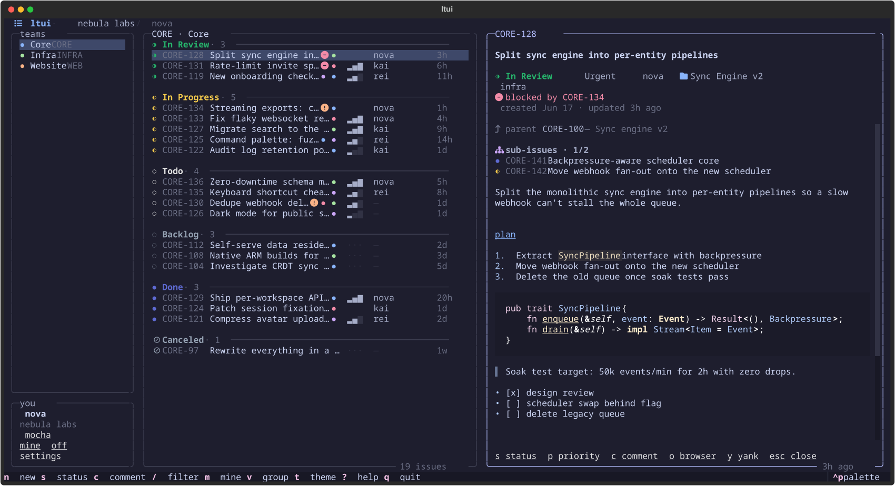
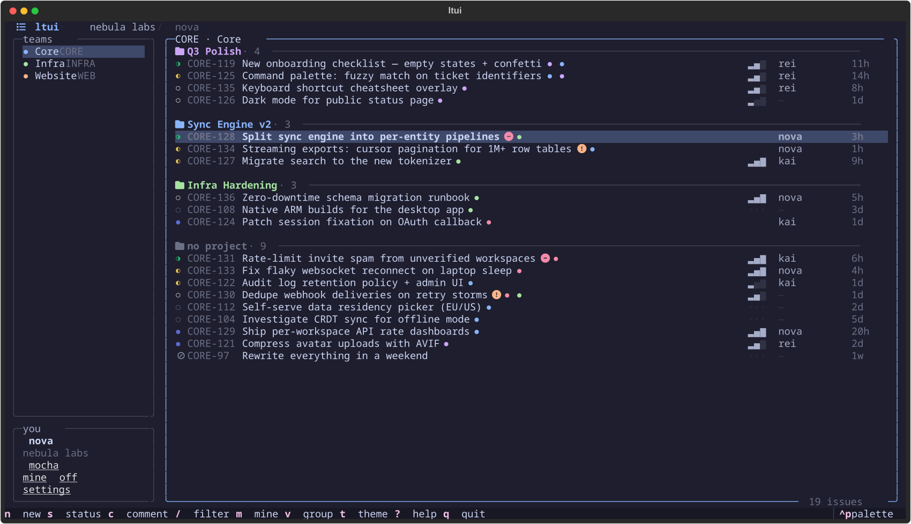
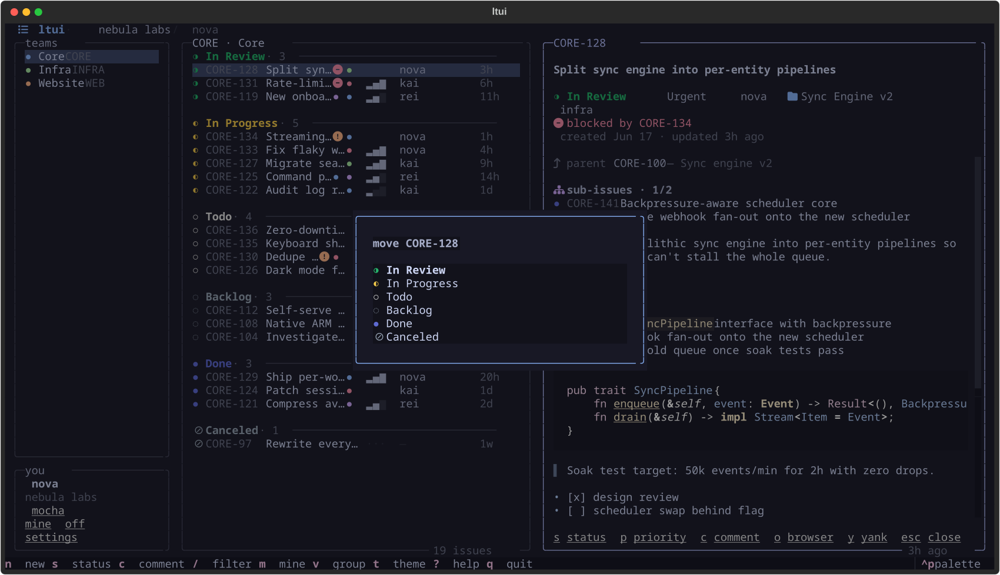
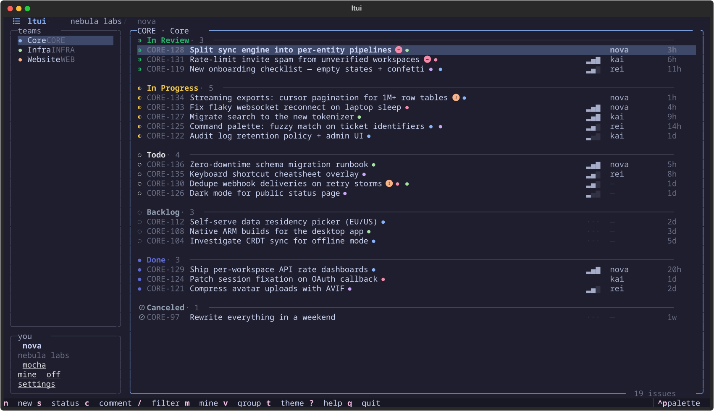
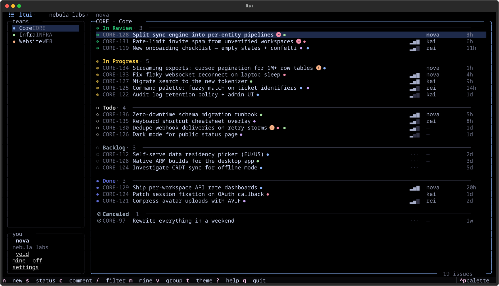
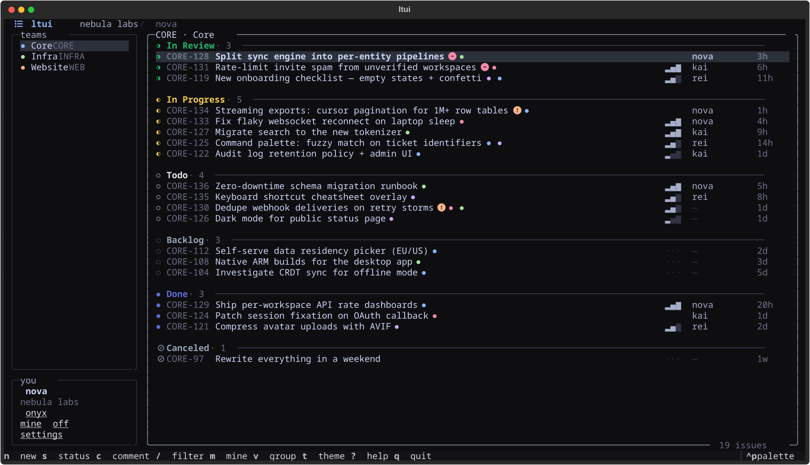
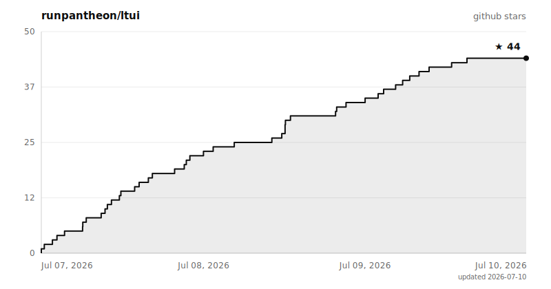

<div align="center">

# ◐ ltui — the tracker TUI suite

**Stupidly fast, actually beautiful terminal UIs for your issue tracker.**

One codebase, one muscle memory, three trackers:
**[Linear](ltui/) · [Jira](jtui/) · [Shortcut](sctui/)**

[](https://www.python.org)
[](https://github.com/Textualize/textual)
[](LICENSE)
[](https://github.com/runpantheon/ltui/stargazers)



<sub>every screenshot in this README is generated from <b>fake demo data</b> by
each app's <code>tools/screenshots.py</code> — no real tickets were harmed</sub>

</div>

---

## pick your tracker

| app | tracker | install | run |
| --- | --- | --- | --- |
| [**◐ ltui**](ltui/) | [Linear](https://linear.app) | `pipx install "git+https://github.com/runpantheon/ltui#subdirectory=ltui"` | `ltui` |
| [**◑ jtui**](jtui/) | [Jira](https://www.atlassian.com/software/jira) | `pipx install "git+https://github.com/runpantheon/ltui#subdirectory=jtui"` | `jtui` |
| [**◐ sctui**](sctui/) | [Shortcut](https://www.shortcut.com) | `pipx install "git+https://github.com/runpantheon/ltui#subdirectory=sctui"` | `sctui` |

`uv tool install` works the same way. Works on linux · macOS · windows,
python ≥ 3.11, best with a [nerd font](https://www.nerdfonts.com/).
There is **nothing to configure by hand** — each app walks you through
auth on first launch, validates it live, and greets you with a 20-second
tour. Each app's README ([ltui](ltui/) · [jtui](jtui/) · [sctui](sctui/))
has its full tour, screenshots, and tracker-specific notes.

## why this exists

Every tracker TUI we tried had the same two problems: **slow** and **ugly**.
The slowness isn't even their fault — tracker APIs take seconds to return a
busy board. These apps just refuse to make you wait:

```
launch ──▶ render cached board (~50ms) ──▶ you're already working
                    │
                    └──▶ background refresh ──▶ rows swap in silently
```

- 📦 **instant startup** — your last-seen board renders from a local cache
  while fresh data loads behind it; a braille spinner in the border tells
  you when a sync is in flight, and the board silently re-syncs every few
  minutes after that
- 🎨 **actually pretty** — rounded borders, the trackers' own state colors,
  nerd-font icons, priority bars, subtle fade animations
- ⌨️ **keyboard first, mouse welcome** — vim keys everywhere, but everything
  is clickable, and the panel dividers drag to resize

## what they all do

|     |                                                                                     |
| --- | ----------------------------------------------------------------------------------- |
| 🗂️  | **smart grouping** — `In Review` → `In Progress` → `Todo` → `Backlog` → `Done`, sorted by how close work is to shipping, freshest tickets first inside every group |
| 👤  | **mine first** — your tickets float to the top of every group; `m` hides everyone else |
| 📁  | **epic / project view** — `v` regroups the whole board, `V` zooms into one, `P` moves tickets between them (or creates one inline) |
| 🏷️  | **label editing** — `l` opens a multi-select editor over your tracker's labels |
| 👥  | **assign without leaving** — `a` reassigns to anyone on the team, or you, or nobody |
| 🌿  | **`y` yanks a git branch** — ticket → `git checkout -b` in seconds |
| 🌳  | **hierarchy aware** — parent tickets, sub-issues/subtasks with done-counts, and blocked/blocking badges with the exact tickets named |
| 📖  | **rich detail panel** — full markdown descriptions, labels, comments — scrolls with arrows, vim keys, or mouse |
| ✏️  | **write, don't just read** — create tickets, change status & priority, comment, all from the keyboard |
| 🔍  | **instant filter** — `/` narrows by title, identifier, or assignee as you type |
| 🌚  | **five themes** — `mocha`, OLED-black `void`, monochrome `onyx`, `clear` (no background — your terminal's transparency shows through), and `system` (your terminal's own ANSI palette) — with live preview as you scroll the picker |
| 🎛️  | **fully remappable** — every key rebindable via `config.json` (`--init-config`), vim motion layer (`ctrl+d/u`, `[`/`]` group jumps, `:` palette) out of the box |
| 🧠  | **remembers everything** — last team, theme, layout widths, toggles persist |

<div align="center">

</div>

## the detail panel

Enter (or a click) opens any ticket in a resizable side panel — markdown
rendered properly, parent + sub-items with a done-count, blockers named,
comments threaded underneath, and every action one key away.

<div align="center">

</div>

## themes

Cycle with `t`, or live-preview everything with `ctrl+p` → *Change theme* —
the whole app restyles as you scroll.

|  `mocha` | `void` | `onyx` |
| --- | --- | --- |
|  |  |  |

And two that can't be screenshotted honestly: **`clear`** paints no
background at all (your terminal's blur/transparency shows through), and
**`system`** draws the whole UI in your terminal's own ANSI palette — your
kitty theme *is* the app theme. Made for rice.

## one muscle memory

The three apps share ~80% of their code through a normalizing adapter
layer, so every key, theme, and habit transfers between trackers. Where the
trackers differ, each app does the native thing: jtui's status changes are
workflow-aware **transitions**, sctui's `p` sets the **story type**
(bug/feature/chore) since Shortcut has no priority field, epics/projects
map to whatever the tracker calls them. The shared design system is
published separately as [**ricekit**](https://github.com/Gheat1/ricekit).

## star history

<div align="center">
<a href="https://star-history.com/#runpantheon/ltui&Date">
<picture>
<source media="(prefers-color-scheme: dark)" srcset="assets/star-history-dark.svg">

</picture>
</a>

<sub>rendered in-repo by <a href=".github/workflows/star-chart.yml">a tiny workflow</a> — refreshes on every star</sub>
</div>

## history & credits

Built by [**@Gheat1**](https://github.com/Gheat1) — the suite started as
three repos on his account and earned its first stars there — and now
developed under the **Pantheon** organization with company backing.
Standing on the shoulders of [textual](https://github.com/Textualize/textual).

Contributions welcome — read [CONTRIBUTING.md](CONTRIBUTING.md) first
(dual-licensing means contributions need a license grant).

## license

**Dual-licensed:**

- [**GPL-3.0**](LICENSE) for the community — free to use anywhere, work
  included. Forks and redistributions must remain open source under the
  same terms with credit, which means **closed-source rebranding or resale
  is not permitted**.
- **Commercial licenses** from Pantheon for anything the GPL doesn't allow —
  open an issue to talk.

Copyright (C) 2026 Gheat / Pantheon · see [NOTICE](NOTICE)

<div align="center">
<sub>not affiliated with Linear, Atlassian, or Shortcut — just fans of good issue trackers and good terminals</sub>
</div>
