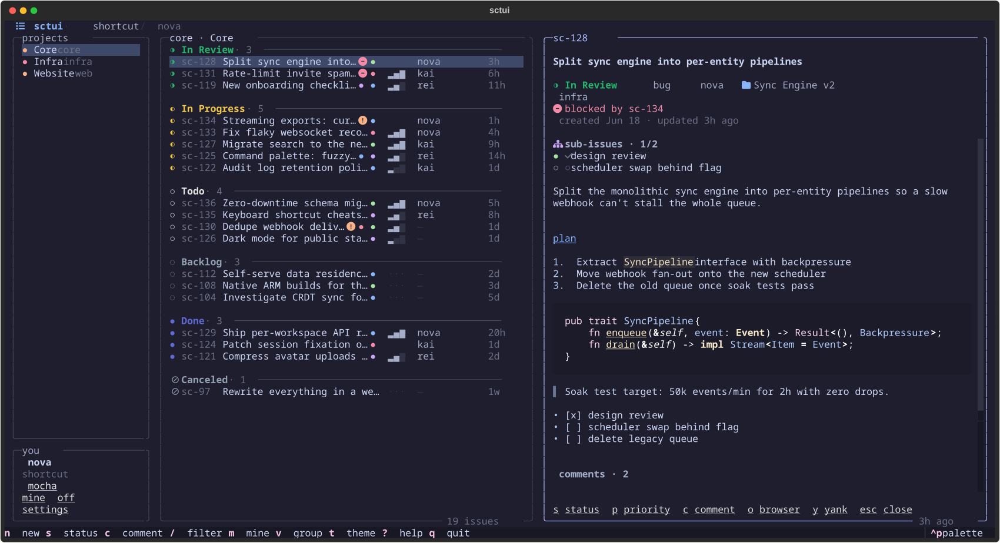
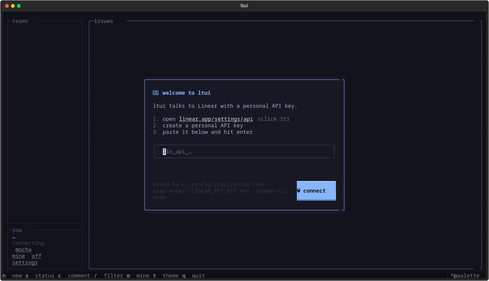
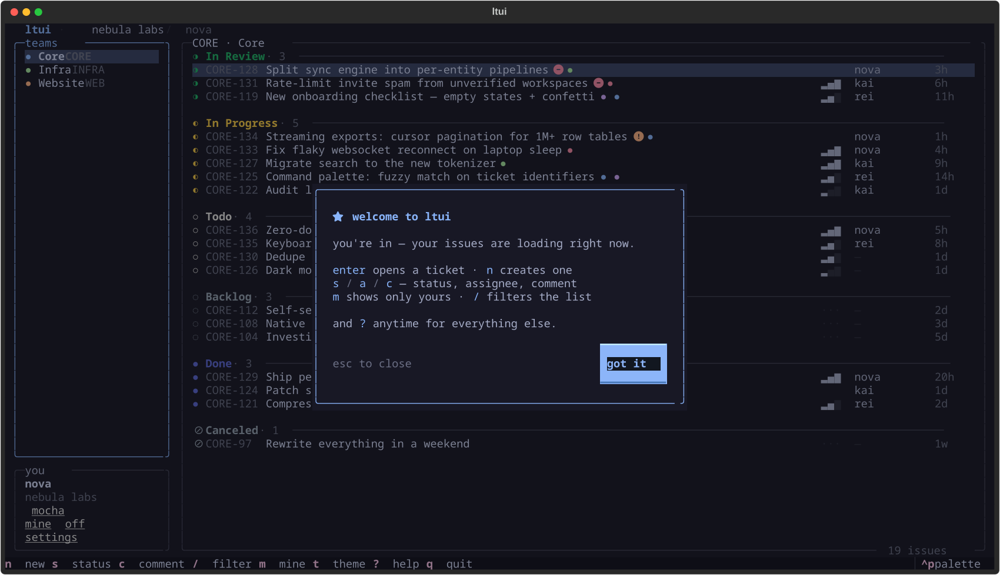
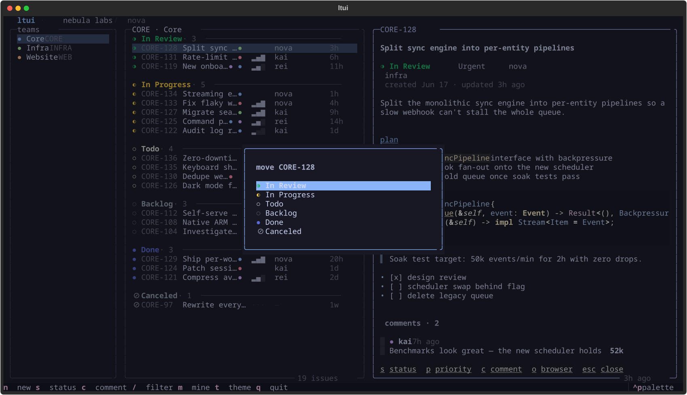
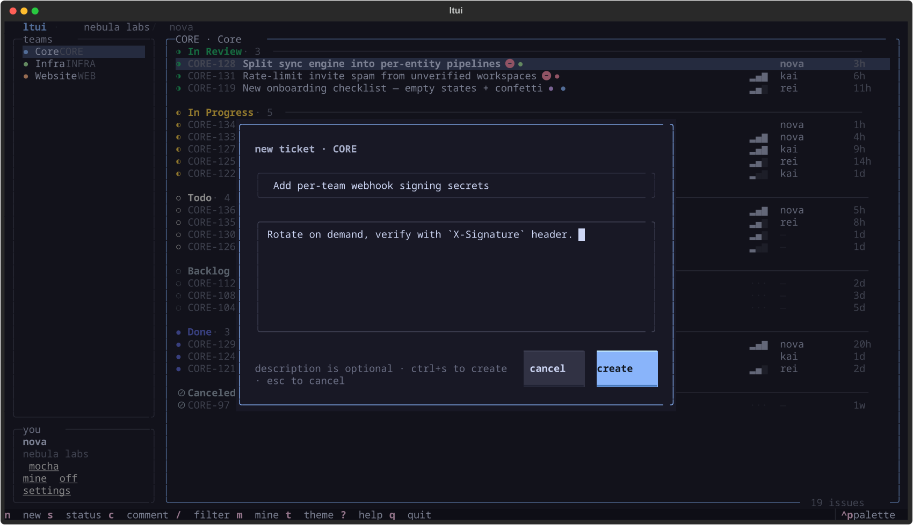
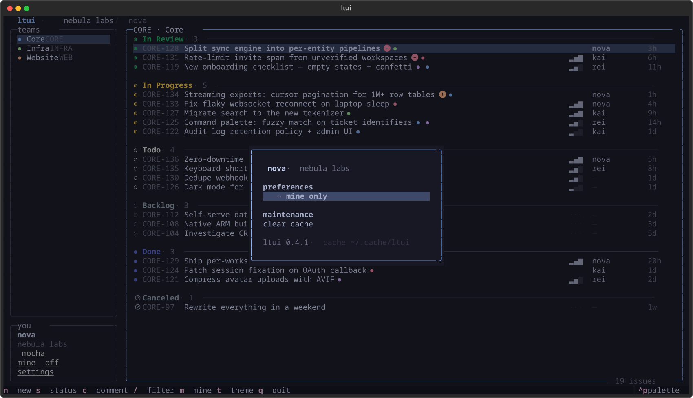
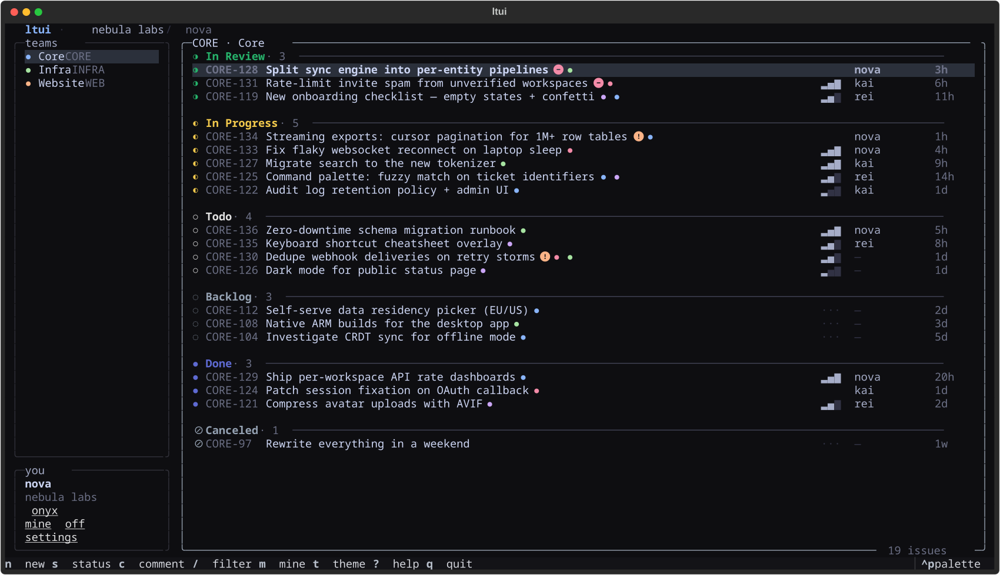
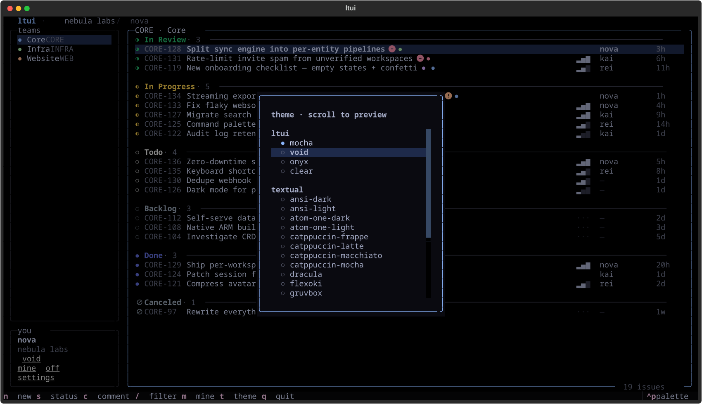

<div align="center">

# ◐ ltui

**A stupidly fast, actually beautiful TUI for [Linear](https://linear.app).**

Your whole workspace, grouped the way triage actually works —
`In Review` on top, `Done` at the bottom, your tickets first.

[](https://www.python.org)
[](https://github.com/Textualize/textual)
[](LICENSE)
[](https://developers.linear.app)



<sub>every screenshot in this README is generated from <b>fake demo data</b> by
<a href="tools/screenshots.py"><code>tools/screenshots.py</code></a> — no real tickets were harmed</sub>

</div>

---

## why another Linear TUI?

Because every Linear TUI I tried had the same two problems: **slow** and **ugly**.

The slowness isn't even their fault — Linear's GraphQL API takes 2–5 seconds to
return a decently sized team. Most TUIs just make you eat that wait on every
launch. ltui doesn't:

- 📦 **instant startup** — your last-seen issues render from a local cache in
  ~50ms while fresh data loads in the background. You're scrolling before the
  API has even said hello.
- 🎨 **actually pretty** — rounded borders, five themes,
  Linear's own state colors, nerd font icons, priority bars like the real app,
  and subtle fade animations on panels and modals.
- ⌨️ **keyboard first, mouse welcome** — vim keys everywhere, but everything is
  also clickable: tickets, teams, even the hint bar. The panel dividers
  **drag to resize** (double-click to reset), and your layout sticks.

## features

|     |                                                                                     |
| --- | ----------------------------------------------------------------------------------- |
| 🗂️  | **smart grouping** — `In Review` → `In Progress` → `Todo` → `Backlog` → `Done` — sorted by how close work is to shipping, freshest tickets first inside every group |
| 👤  | **mine first** — your tickets float to the top of every group; press `m` to hide everyone else entirely |
| 🌿  | **`y` yanks the git branch** — Linear's generated branch name straight to your clipboard (or the URL / identifier); ticket → `git checkout -b` in seconds |
| 👥  | **assign without leaving** — `a` reassigns to anyone on the team, or you, or nobody |
| 🌳  | **hierarchy aware** — the detail panel shows the parent ticket and all sub-issues with a done-count, next to blocked/blocking relations |
| 🔄  | **never stale** — the board silently re-syncs every 3 minutes |
| 📖  | **rich detail panel** — full markdown descriptions (code blocks, checklists, quotes), labels, comments — scrolls with arrows, vim keys, or mouse wheel |
| ✏️  | **write, don't just read** — create tickets, change status & priority, add comments without leaving the terminal |
| 🚧  | **blocked & blocking at a glance** — a red badge on tickets that are blocked, an orange one on tickets holding others up; the detail panel names the exact tickets |
| 🔍  | **instant filter** — `/` fuzzy-narrows by title, identifier, or assignee as you type |
| 🌚  | **five themes** — `mocha`, pure-black `void`, monochrome `onyx`, `clear` (no background — your terminal's transparency/blur shows through), and `system` (drawn in your terminal's own ANSI palette: your kitty theme *is* the ltui theme) — cycle with `t` |
| ⚙️  | **profile & settings** — who you are bottom-left, `,` opens a settings panel with live theme preview, preferences, and cache controls |
| 🧠  | **remembers everything** — last team, theme, filters persist across sessions |
| 🔌  | **zero config** — reuses your [linear-cli](https://github.com/Finesssee/linear-cli) API key, or set `LINEAR_API_KEY` |

## install

works on any linux · macOS · windows, straight from this repo.
grab [uv](https://docs.astral.sh/uv/) or [pipx](https://pipx.pypa.io) and:

```sh
uv tool install git+https://github.com/Gheat1/ltui
# or
pipx install git+https://github.com/Gheat1/ltui
```

or build it yourself from source:

```sh
git clone https://github.com/Gheat1/ltui && cd ltui
pip install .
```

either way you now have the command:

```sh
ltui
```

upgrading later: `uv tool upgrade ltui-linear` / `pipx reinstall ltui-linear`
(the *package* is named `ltui-linear`; the command is `ltui`).

<details>
<summary><b>platform notes</b></summary>

- **linux** — any terminal that isn't from 1985 works: kitty, alacritty,
  ghostty, wezterm, foot…
- **macOS** — `brew install pipx` first if you don't have it. iTerm2, ghostty,
  kitty, or WezTerm recommended over stock Terminal.app.
- **windows** — Python 3.11+ (`winget install Python.Python.3.12`), then pipx.
  Run it in **Windows Terminal** — legacy conhost will not do it justice.
- everywhere: needs **python ≥ 3.11**.

</details>

> [!TIP]
> Use a terminal with a [nerd font](https://www.nerdfonts.com/) for the icons.
> Everything else degrades gracefully without one.

## auth

**there is nothing to set up.** launch `ltui` and if no key is found, it
walks you through it: click the link to Linear's API-keys page, paste the
key, done — ltui validates it live and stores it in
`~/.config/ltui/config.toml` (permissions `600`).

<div align="center">

</div>

already set up somewhere? ltui checks, in order:

1. the `LINEAR_API_KEY` environment variable
2. its own `~/.config/ltui/config.toml`
3. your [linear-cli](https://github.com/Finesssee/linear-cli) config — if you
   already use linear-cli, ltui logs in with zero setup

Your key never leaves your machine — ltui talks directly to
`api.linear.app` and nothing else.

First launch also greets you with a 20-second tour card (once, never again),
and `?` opens the full keybinding cheatsheet whenever you need it.

<div align="center">

</div>

## keys

| key      | action                                        |
| -------- | --------------------------------------------- |
| `↑↓` `jk` | move around (lists *and* the detail panel)   |
| `enter` / click | open ticket detail panel                |
| `esc`    | close panel / dismiss modal / clear filter    |
| `n`      | **new ticket** in the current team            |
| `s`      | change **status**                             |
| `p`      | change **priority**                           |
| `a`      | change **assignee** (or unassign)             |
| `c`      | add a **comment** (`ctrl+s` to send)          |
| `o`      | open ticket in **browser**                    |
| `y`      | **yank** — copy branch name / url / id        |
| `/`      | filter issues                                 |
| `m`      | toggle **mine only**                          |
| `t`      | cycle **theme**                               |
| `,`      | open **settings**                             |
| `r`      | refresh                                       |
| `g` `G`  | jump to top / bottom                          |
| `?`      | **help** — keybinding cheatsheet              |
| `q`      | quit                                          |

## the detail panel

`enter` (or a click) opens any ticket in a side panel — markdown description
rendered properly, comments threaded underneath, and every action one key away.
The footer hints are clickable too.

<div align="center">

</div>

## creating tickets

`n` opens a minimal composer: title, optional markdown description, `ctrl+s`.
The ticket lands in your list already highlighted, ready for `s` / `p` to
slot it into the right column.

<div align="center">

</div>

## settings

Your profile lives bottom-left — name, org, and one-click toggles for theme
and mine-only. Press `,` (or click ` settings`) for the panel:
flip preferences, clear the cache.

<div align="center">

</div>

## themes

Cycle with `t`. Your choice sticks.

|  `mocha` — catppuccin warmth | `void` — pure black, OLED bait | `onyx` — monochrome steel |
| --- | --- | --- |
|  |  |  |

Two of them can't be screenshotted honestly:

- **`clear`** paints **no background at all** — ltui runs on your terminal's
  own background, so if your terminal is transparent or blurred, ltui is too.
- **`system`** goes further: the whole UI chrome is drawn in your terminal's
  **ANSI palette** (plus the transparent background) — whatever theme your
  kitty/alacritty/ghostty is running, ltui matches it automatically. Ticket
  data (state colors, labels) stays true to Linear.

Made for rice.

Not enough? `ctrl+p` → *Change theme* opens the theme picker with **every
built-in Textual theme** — nord, gruvbox, dracula, tokyo-night, rose-pine, the
whole catppuccin family and more. The whole app **restyles live as you scroll**
the list; `enter` keeps it, `esc` puts everything back. `t` keeps cycling the
four ltui themes.

<div align="center">

</div>

## how it's fast

Linear's API is the bottleneck — a 250-issue team takes **2.5–4.5s** to fetch,
and no client can fix that. So ltui stops pretending the network is fast:

```
launch ──▶ render cached issues (~50ms) ──▶ you're already working
                    │
                    └──▶ background refresh ──▶ rows swap in silently
```

- issue lists cache to `~/.cache/ltui/` per team
- mutations (status, priority, new tickets) update the cache immediately —
  what you see is always what you did
- the `↻ refreshing` badge in the border tells you when fresh data is inbound
- the board silently re-syncs every 3 minutes, so it never goes stale

## data & privacy

- **reads**: teams, issues, workflow states, comments — for the teams you view
- **writes**: only the mutations you explicitly trigger (create / status /
  priority / comment)
- **talks to**: `api.linear.app` — nothing else, no telemetry, no analytics
- **stores locally**: cache in `~/.cache/ltui/`, UI state in
  `~/.local/state/ltui/state.json`

## faq

<details>
<summary><b>Only ~250 issues show per team?</b></summary>

ltui fetches the 250 most-recently-updated issues per team. For triage that's
effectively everything alive; ancient `Done` tickets fall off the bottom,
which is where they belong.

</details>

<details>
<summary><b>Why do the screenshots look fake?</b></summary>

Because they are! They're generated by <code>tools/screenshots.py</code> with a
mocked API — fake org, fake tickets, fake people. Run it yourself; it never
touches the network.

</details>

<details>
<summary><b>Some icons render as boxes</b></summary>

Install a <a href="https://www.nerdfonts.com/">nerd font</a> and set it as your
terminal font. Everything else degrades gracefully.

</details>

<details>
<summary><b>Does it work with multiple workspaces?</b></summary>

It uses one API key at a time (the linear-cli "current" workspace, or
<code>LINEAR_API_KEY</code>). Switch workspaces the same way you would with
linear-cli.

</details>

## contributing

It's one Python file. Read it in ten minutes, break it in five:

```sh
git clone https://github.com/Gheat1/ltui && cd ltui
python -m venv .venv && .venv/bin/pip install -e . && .venv/bin/ltui
```

PRs welcome — keep it fast, keep it pretty.

## credits

made by [**@Gheat1**](https://github.com/Gheat1) — issues, ideas, and PRs
welcome over at [Gheat1/ltui](https://github.com/Gheat1/ltui).

standing on the shoulders of [textual](https://github.com/Textualize/textual)
and the [Linear API](https://developers.linear.app).

## license

[MIT](LICENSE)

<div align="center">
<sub>not affiliated with Linear — just a fan of good issue trackers and good terminals</sub>
</div>
