

# ◐ sctui — gallery

Every screenshot of [**sctui**](../) in one scrollable place.

All of it is <b>fake demo data</b> generated by <a href="../tools/screenshots.py"><code>tools/screenshots.py</code></a> — no real tickets were harmed.

---

## the board

The full layout — status-grouped issue list on the left, rich detail panel on the right.

## welcome tour

First launch greets you with a 20-second tour.

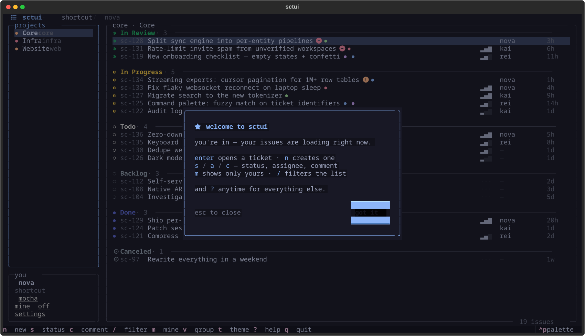

## onboarding

Guided auth — paste a key, it validates live, nothing to configure by hand.

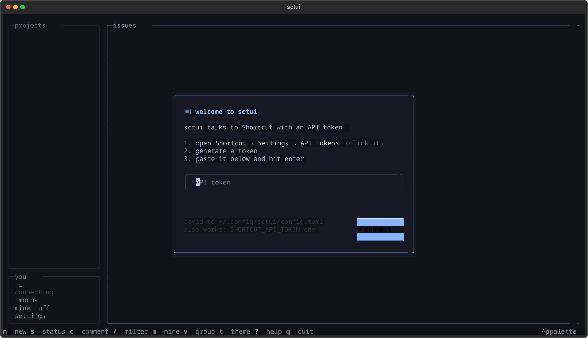

## the list

The board in `mocha`, the default theme — freshest tickets first inside every group.

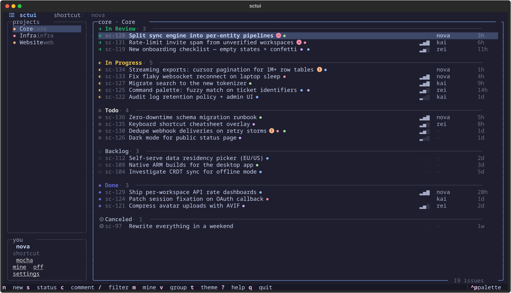

## epic view

`v` regroups the whole board by epic, `V` zooms into one, `P` moves tickets between them.

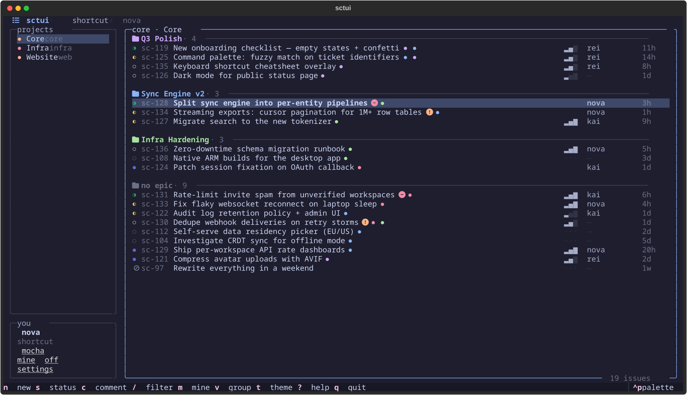

## pickers

Status, priority, assignee — every change is a small picker over the detail panel.

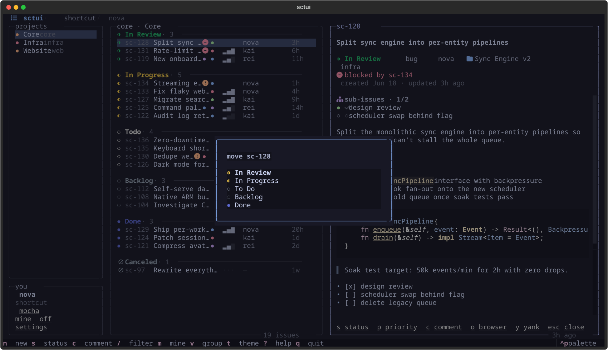

## comments

Threaded under the ticket, written without leaving the keyboard.

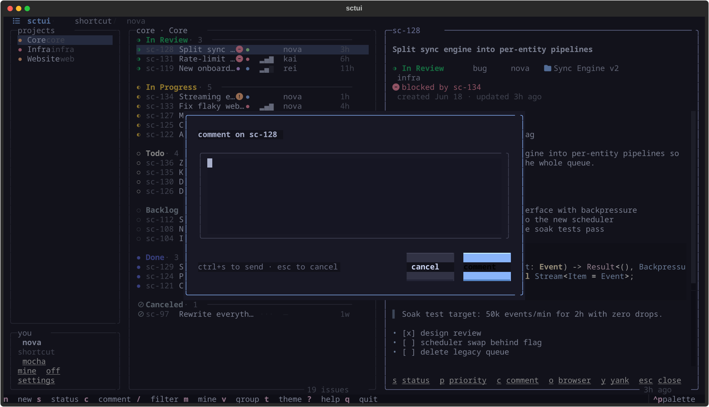

## new ticket

Create tickets inline — title, description, status, priority.

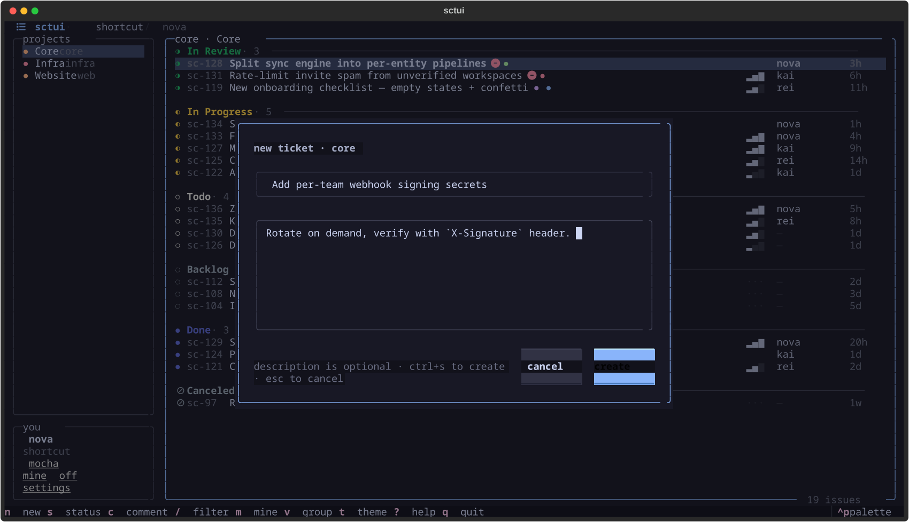

## settings

Every key rebindable via `config.json`, every preference remembered.

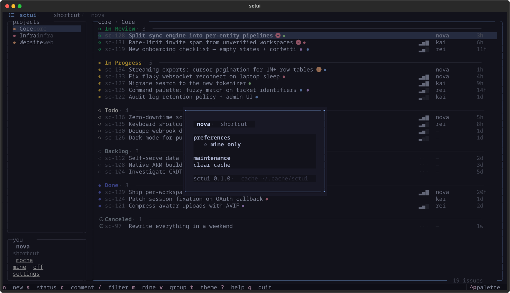

## themes

Live preview as you scroll the picker — the whole app restyles under you.

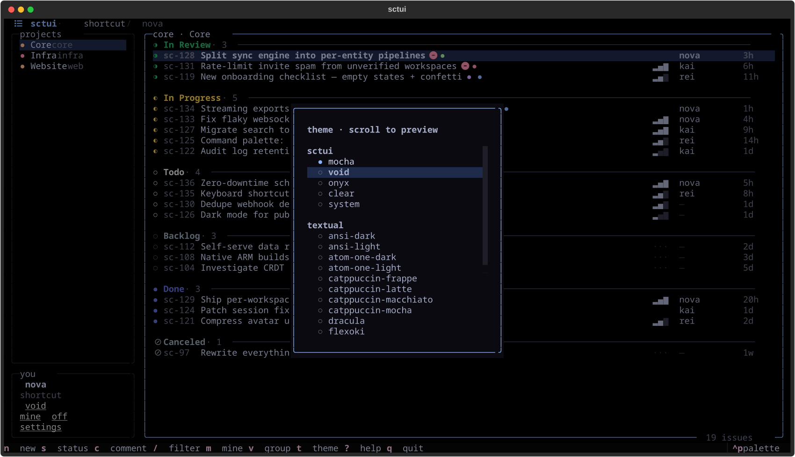

### `void`

OLED black.

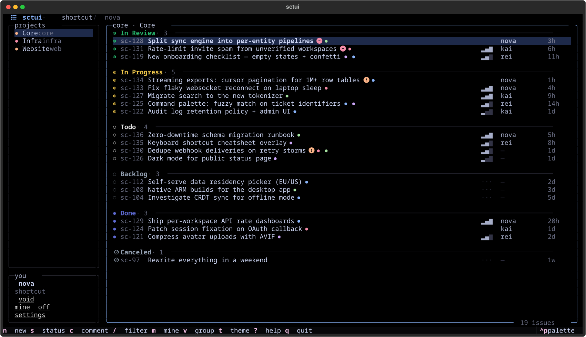

### `onyx`

Monochrome.

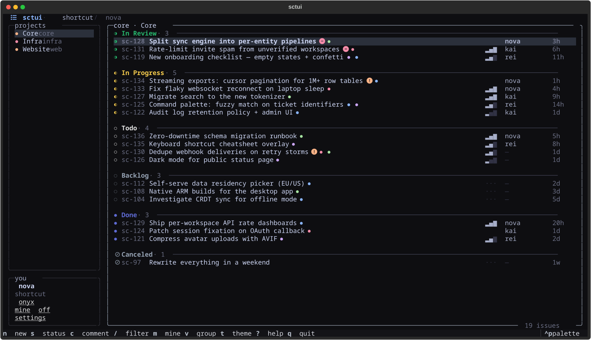

---

siblings: <a href="../../jtui/assets/">jtui gallery</a> · <a href="../../ltui/assets/">ltui gallery</a> · back to <a href="../../">the suite</a>

